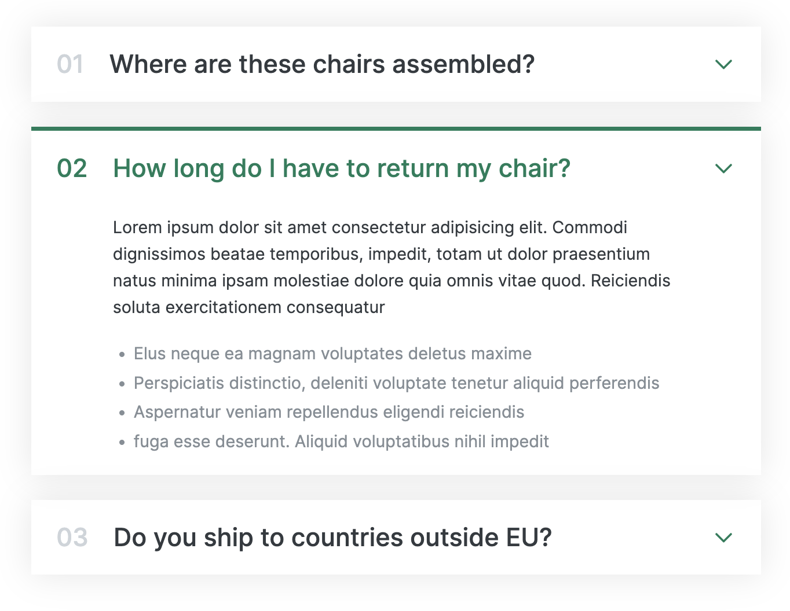

```
주요 제목을 펼치면 상세 내용이 나오는 component
```



<br>

<br>

<h2 id="none">💡 display none</h2>

```
상세내용을 접어 둘 때 사용

javaScript를 이용해서 펼치고 접는다.
```

<br>

<h2 id="none">💡 SVG icon</h2>

[> svg icon 👀](https://developer.mozilla.org/ko/docs/Web/SVG)

```
Scalable Vector Graphics

크기 상관없이 깨지지 않고 렌더링 되는 icon
```

<br>

<h2 id="none">💡 grid</h2>

```
position, flex의 부족한 점을 보완하는 정렬 방식

2 dimension으로 row, column을 이용해서 layout을 짤 수 있다.
```
