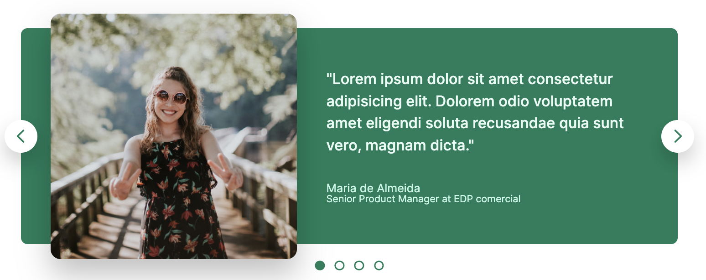
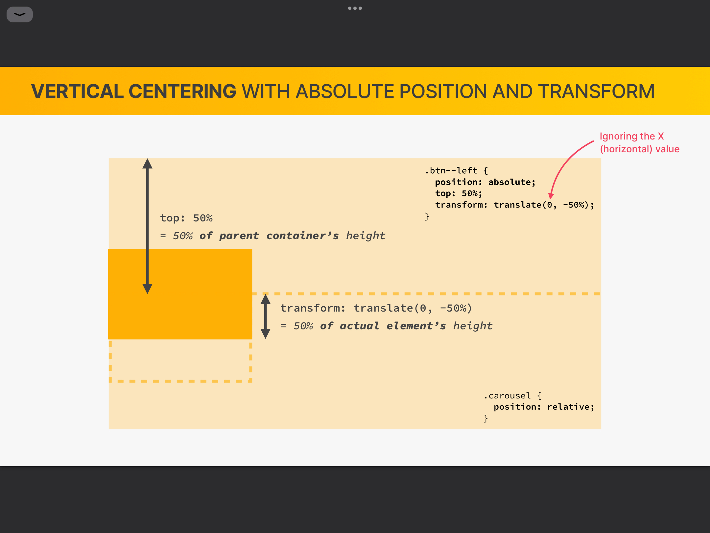

# carousel

```
displays a series of images that slide or fade out, one at a time.
```



<br>

## blockquot

```
testimonial box에서 주로 쓰이며 제품이나 서비스를 이용한 고객들의 후기를 담을 수 있는 태그.
```

## transform: scale()

```
element의 기본 크기에서 키우거나 줄일 수 있다.
()에는 0.5,1.5 등 원하는 배수를 적는다
```

## translate + absolute

```
transform: translate(X, Y)와
absolute position을 이용해서 element를 각 축의 중앙으로 정렬 가능

flex를 이용할 수 없거나 element를 flex item으로 만들기 싫을 때 사용할 수 있음
```



```
√ position : absolute
√ top/right: 50%
√ transform: translate(0,-50%)/(-50%,0)
```
