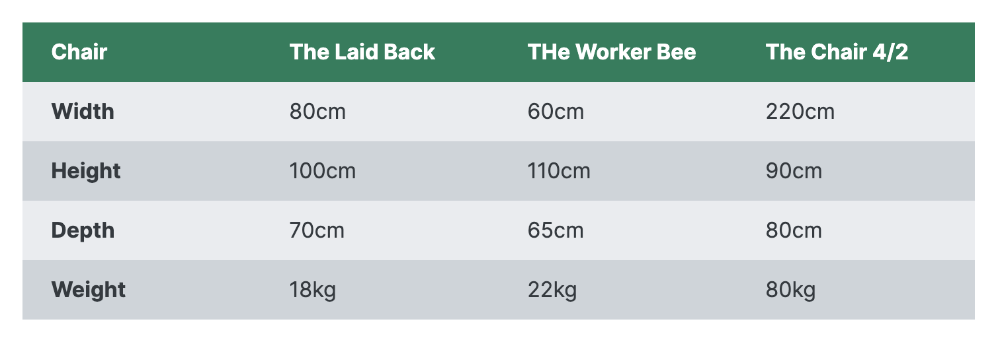

# table

```
grid, flex 이전에 자주 쓰던 방식

현재는 데이터를 정리할 때 쓰인다
```

## table tags

```html
<table>
  <thead>
    <tr>
      <th></th>
    </tr>
  </thead>

  <tbody>
    <tr>
      <td></td>
    </tr>
  </tbody>
</table>
```

### th

- text align: center

- font-weight: bold


